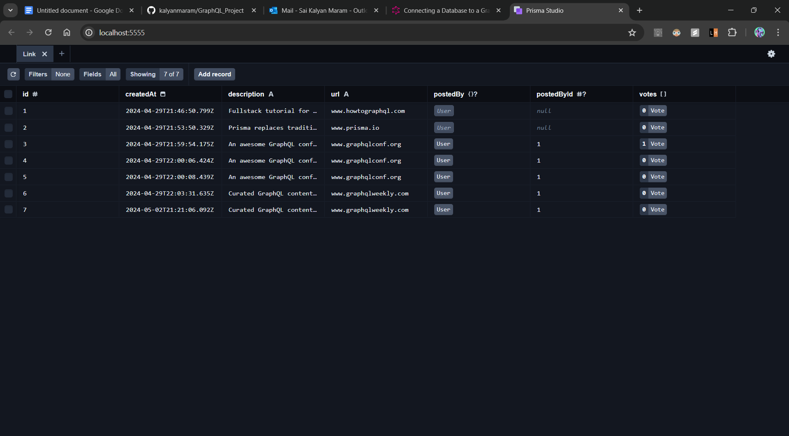
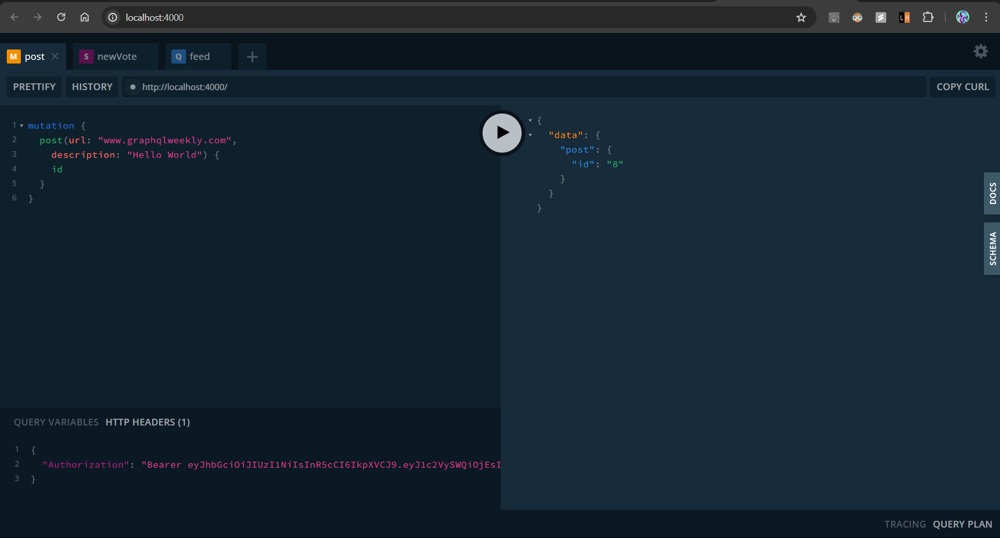
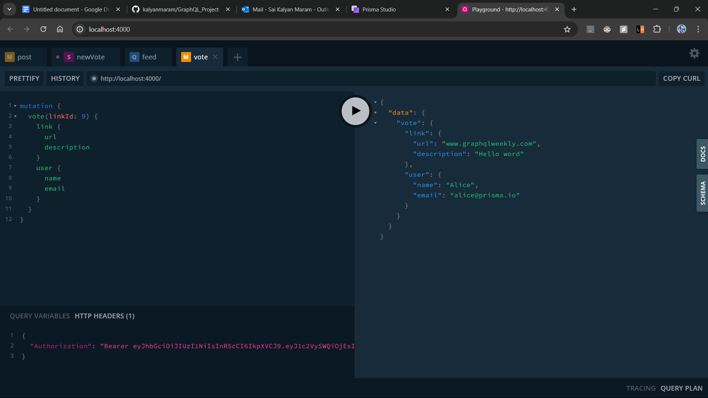
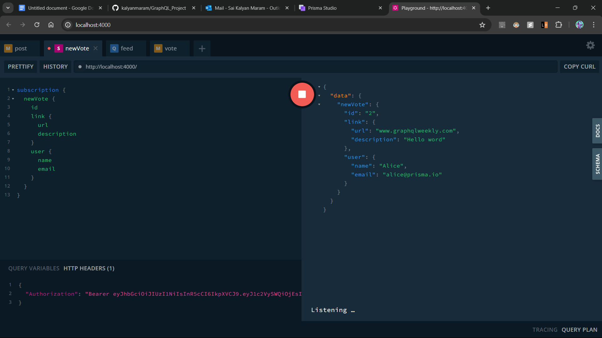
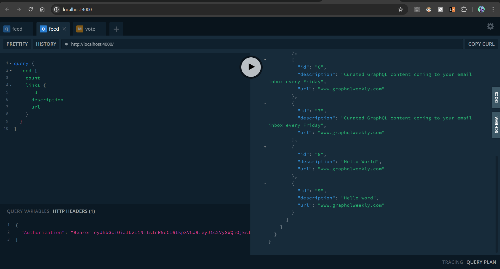

# GraphQL Project

This project is a simple implementation of a GraphQL server using Apollo Server and Prisma. It demonstrates user authentication, real-time subscriptions, and connecting to a database.

## Getting Started

These instructions will get you a copy of the project up and running on your local machine for development and testing purposes.

### Installing

1. Clone the repository
```sh
git clone https://github.com/kalyanmaram/GraphQL_Project.git
```

2. Navigate to the project directory
```sh
cd GraphQL_Project
```

3. Install dependencies
```sh
npm install
```

4. Generate Prisma client
```sh
npx prisma generate
```

5. Run the script to populate the database with initial data
```sh
node script.js
```

6. Start the GraphQL server
```sh
node index.js
```

Your GraphQL server is now running at http://localhost:4000. You can access the GraphQL Playground and start sending queries and mutations at this URL.

### Diagrams

- Connecting The Server and Database with Prisma Client



- Authentication



- Realtime GraphQL Subscriptions





- Summary

